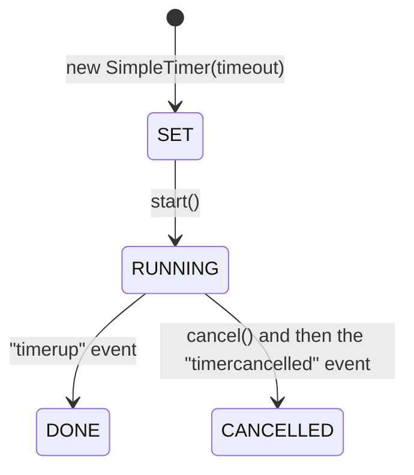

# Promise-based simple timer for Node.js

[](https://opensource.org/licenses/MIT)

This module provides a simple, promise-based timer for Node.js. It allows the creation of timers that can be awaited asynchronously, making it easier to manage timeouts and delays in your code. The `SimpleTimer` class supports starting and cancelling the timers, and also provides information about the timer's state.

## Table of Contents
- [What is New](#what-is-new)
- [Installation](#installation)
- [Usage](#usage)
	- [Starting a Timer](#starting-a-timer)
	- [Cancelling a Timer](#cancelling-a-timer)
	- [Using Timer States](#using-timer-states)
- [Timer States](#timer-states)
- [The `SimpleTimer` Class](#the-simpletimer-class)
	- [Static Properties](#static-properties)
	- [Instance Properties](#instance-properties)
	- [Instance Methods](#instance-methods)
- [Testing](#testing)
- [Contributing](#contributing)
- [License](#license)

## What is New

### Version 3.0.1

- Updated the minimum Node.js engine required to version 20.

### Version 3.0.0

- Simple Timer is now an ES6 module. This provides better support for tools like ESLint 9 and a cleaner code syntax.

### Version 2.0.1

- Fixed a bug in `package.json` where the `main` field was pointing to the wrong file.

### Version 2.0.0

- The `SimpleTimer` class is now exported as a named export.
- Refactored and enhanced the JSDoc comments for better clarity and type checking.
- Renamed and moved several files for a better project structure.
- Bug fixes.

### Version 1.0.1

- Initial release.

## Installation

You can install this module via `npm`:

```shell
npm install @jfabello/simple-timer
```

## Usage

To use the `simple-timer` module, first import it into your code and then create an instance of the `SimpleTimer` class.

Here are some examples:

### Starting a Timer

```javascript
import { SimpleTimer } from "@jfabello/simple-timer";

async function someAsyncFunction() {
    // Creates a new SimpleTimer instance with a 2000 ms timeout
    let timer = new SimpleTimer(2000);

	// Start the timer and wait for it to finish
    await timer.start();
	console.log("Timer done!");
}

someAsyncFunction();
```

### Cancelling a Timer

```javascript
import { SimpleTimer } from "@jfabello/simple-timer";

async function someAsyncFunction() {
    // Creates a new SimpleTimer instance with a 2000 ms timeout
    let timer = new SimpleTimer(2000);

	// Start the timer and wait for it to finish
    let timerPromise = timer.start();

	// Cancel the timer after 1000 ms
	setTimeout(async () => {
		timer.cancel();
		await timerPromise;
		console.log("Timer cancelled!");
	}, 1000);
}

someAsyncFunction();
```

### Using Timer States

```javascript
import { SimpleTimer } from "@jfabello/simple-timer";

async function someAsyncFunction() {
	// Creates a new SimpleTimer instance with a 2000 ms timeout
	let timer = new SimpleTimer(2000);

	// Start the timer and wait for it to finish
	let timerPromise = timer.start();

	// Report the state of the timer every 500 ms
	let interval = setInterval(() => {
		console.log(`Timer state: ${timer.state.toString()}`);
		if (timer.state === SimpleTimer.DONE || timer.state === SimpleTimer.CANCELLED) {
			clearInterval(interval);
			clearTimeout(timeout);
		}
	}, 500);

	// Cancel the timer after 1000 ms
	let timeout = setTimeout(async () => {
		timer.cancel();
		await timerPromise;
		console.log("Timer cancelled!");
	}, 1500);
}

someAsyncFunction();
```

The code above should output the following to the console:

```
Timer state: Symbol(RUNNING)
Timer state: Symbol(RUNNING)
Timer cancelled!
Timer state: Symbol(CANCELLED)
```

## Timer States

The `SimpleTimer` class provides the following states:



## The `SimpleTimer` Class

A simple timer class that provides a way to set, start, and cancel a timer with a specified timeout.

### Static Properties

- `SET`: Read-only property representing the SET timer state.
- `RUNNING`: Read-only property representing the RUNNING timer state.
- `DONE`: Read-only property representing the DONE timer state.
- `CANCELLED`: Read-only property representing the CANCELLED timer state.
- `errors`: Read-only property that contains the simple timer error classes as its properties.

### Instance Properties

- `state`: The timer instance state.

### Instance Methods

#### `constructor(timeout)`

Creates a new `SimpleTimer` instance with the specified timeout.

##### Parameters

- `timeout`: The timeout duration in milliseconds. Must be an integer greater than 0.

##### Throws

- `ERROR_SIMPLE_TIMER_TIMEOUT_TYPE_INVALID`: If the timeout is not an integer.
- `ERROR_SIMPLE_TIMER_TIMEOUT_OUT_OF_BOUNDS`: If the timeout is less than 1.

#### `start()`

Starts the timer if it is in the `SET` state. If the timer is already running, it returns the existing timer promise. If the timer is not in the `SET` or `RUNNING` states, it throws an error.

##### Returns

A promise that fulfills to `SimpleTimer.DONE` if the timer times out, or `SimpleTimer.CANCELLED` if the timer is cancelled before it times out.

##### Throws

- `ERROR_SIMPLE_TIMER_NOT_IN_SET_OR_RUNNING_STATES`: If the timer is not in the `SET` or `RUNNING` states.

#### `cancel()`

Cancels the simple timer. If the timer is not in the `RUNNING` state, it throws an error.

##### Returns

- A promise that fulfills to `SimpleTimer.CANCELLED` once the timer is cancelled.

##### Throws

- `ERROR_SIMPLE_TIMER_NOT_RUNNING`: If the timer is not running.

## Testing

To run the tests for this module, first clone the repository using the following command:

```shell
git clone https://github.com/jfabello/simple-timer.git
```

Then, navigate to the project directory and install the npm dependencies, this will install the Jest testing framework:

```shell
cd simple-timer
npm install
```

Finally, run the tests using the following command:

```shell
npm test
```

## Contributing

Unfortunately, we are not able to accept contributions at this time.

If you find a bug in the code, please open an issue.

Thank you for your understanding.

## License

This project is licensed under the MIT License. See the [LICENSE](LICENSE) file for details.
